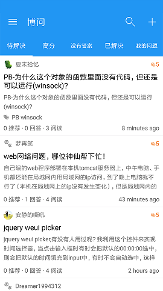

# 介绍

博客园第三方客户端，Xamarin.Forms App。如有意见反馈或bug提交，请加QQ群(181050206)交流.

# API Key

访问博客园API需要申请API KEY,[申请地址](https://oauth.cnblogs.com/)

注意：为了下载项目后能直接运行,已经设置了默认的Key,请申请成功后替换自己的Key.

# 关于Android版

## 截图





## 下载

[酷安应用商店](https://www.coolapk.com/apk/148955)

# 关于IOS版

```
IOS版本暂时没有进行适配...
```

# 支持功能

- 登录博客园

- 查看已发布的博客

- 查看博文，新闻，知识库，添加评论

- 添加收藏，编辑收藏，删除收藏

- 发布闪存，评论闪存

- 支持查看，发布博问，发表回答和评论

- 支持分享博文，新闻，知识库，博问到微信和新浪微博

- 支持搜索功能


## 联系我

QQ群： [181050206](http://shang.qq.com/wpa/qunwpa?idkey=5c281d37638467fb0f411484dcd513b89ba82b58decb8518cc2523b95232dd9b)

JoesWeek

[476920650@qq.com](mailto:476920650@qq.com)
